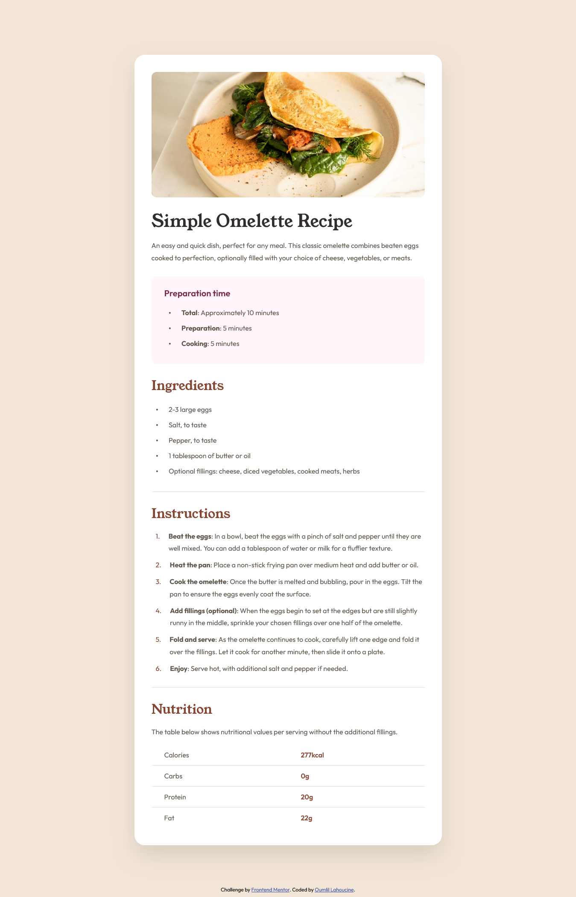

# Frontend Mentor - Recipe page solution

This is a solution to the [Recipe page challenge on Frontend Mentor](https://www.frontendmentor.io/challenges/recipe-page-KiTsR8QQKm). Frontend Mentor challenges help you improve your coding skills by building realistic projects.

## Table of contents

- [Overview](#overview)
  - [The challenge](#the-challenge)
  - [Screenshot](#screenshot)
  - [Links](#links)
  - [Built with](#built-with)
  - [Useful resources](#useful-resources)
- [Author](#author)

## Overview

### The challenge

The challenge is to create the [Recipe page challenge on Frontend Mentor](https://www.frontendmentor.io/challenges/recipe-page-KiTsR8QQKm) and make it look as close to the design provided by [Frontend Mentor](https://www.frontendmentor.io).

### Screenshot

The result:

### Links

- Solution URL: [Frontend-Mentor--Recipe-page-code](https://github.com/OumlilLahoucine/Frontend-Mentor--Recipe-page)
- Live Site URL: [Frontend-Mentor--Recipe-page-live](https://oumlillahoucine.github.io/Frontend-Mentor--Recipe-page/)

<!-- ## My process -->

### Built with

- Semantic HTML5 markup
- CSS custom properties
- Flexbox
- Desktop-first workflow

### Useful resources

- I personally really like the [Build Responsive Real-World Websites with HTML and CSS](https://www.udemy.com/course/design-and-develop-a-killer-website-with-html5-and-css3/) course by 'Jonas Schmedtmann'.

## Author

- Github - [Oumlil Lahoucine](https://github.com/oumlillahoucine)
- Frontend Mentor - [@oumlillahoucine](https://www.frontendmentor.io/profile/OumlilLahoucine)
